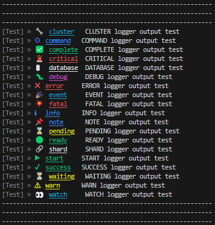

# Key Logger

[](https://badge.fury.io/js/gen-logger)

Unlock the power of customizable logging with Key Logger! This lightweight utility empowers developers to take control of their logs, offering dynamic options, customizable log types, and a sleek interface.

## Features

- **Customizable Logging**: Tailor your logging experience with customizable log types, colors, and labels to suit your application's needs.
- **Dynamic Options**: Easily configure logging options such as log level, scope, and more to adapt to different environments.
- **Sleek Interface**: Enjoy a clean and intuitive logging interface that makes debugging and monitoring a breeze.

## Installation

Install the package via npm:

```bash
npm install gen-logger
```

## Usage

### TypeScript Users

```typescript
import Logger from 'gen-logger';

// Create a new instance of the Logger
const logger = new Logger();

// Log messages
logger.info('Information message');
logger.warn('Warning message');
// Add more log statements as needed
```

### CommonJS Users

```javascript
const Logger = require('gen-logger');

// Create a new instance of the Logger
const logger = new Logger();

// Log messages
logger.info('Information message');
logger.warn('Warning message');
// Add more log statements as needed
```


# Preview



# Example

Common Js

```javascript
const Logger = require('gen-logger');

// Create a new instance of the Logger
const logger = new Logger({ 
    scope: "TEST", // Optional
    disabled: false, // Optional
    interactive: false, // Optional
    logLevel: 'info', // Optional
});

// Log messages
logger.info('Information message');
logger.warn('Warning message');
// Add more log statements as needed
```

Typescript
```typescript
import Logger from 'gen-logger';

// Create a new instance of the Logger
const logger = new Logger({ 
    scope: "TEST", // Optional
    disabled: false, // Optional
    interactive: false, // Optional
    logLevel: 'info', // Optional
});

// Log messages
logger.info('Information message');
logger.warn('Warning message');
// Add more log statements as needed
```

## License

This project is licensed under the MIT License - see the [LICENSE](LICENSE) file for details.
